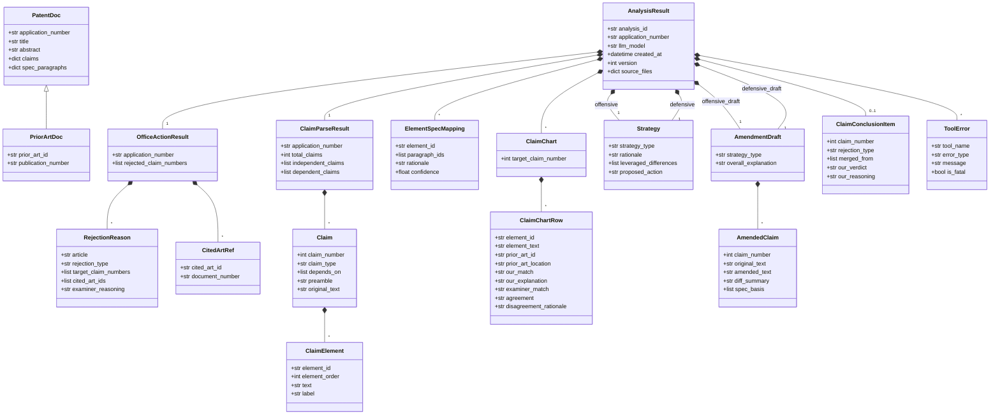

```mermaid
classDiagram
    class PatentDoc {
        +str application_number
        +str title
        +str abstract
        +dict claims
        +dict spec_paragraphs
    }

    class PriorArtDoc {
        +str prior_art_id
        +str publication_number
    }

    class AnalysisResult {
        +str analysis_id
        +str application_number
        +str llm_model
        +datetime created_at
        +int version
        +dict source_files
    }

    class OfficeActionResult {
        +str application_number
        +list rejected_claim_numbers
    }

    class RejectionReason {
        +str article
        +str rejection_type
        +list target_claim_numbers
        +list cited_art_ids
        +str examiner_reasoning
    }

    class CitedArtRef {
        +str cited_art_id
        +str document_number
    }

    class ClaimParseResult {
        +str application_number
        +int total_claims
        +list independent_claims
        +list dependent_claims
    }

    class Claim {
        +int claim_number
        +str claim_type
        +list depends_on
        +str preamble
        +str original_text
    }

    class ClaimElement {
        +str element_id
        +int element_order
        +str text
        +str label
    }

    class ElementSpecMapping {
        +str element_id
        +list paragraph_ids
        +str rationale
        +float confidence
    }

    class ClaimChart {
        +int target_claim_number
    }

    class ClaimChartRow {
        +str element_id
        +str element_text
        +str prior_art_id
        +str prior_art_location
        +str our_match
        +str our_explanation
        +str examiner_match
        +str agreement
        +str disagreement_rationale
    }

    class Strategy {
        +str strategy_type
        +str rationale
        +list leveraged_differences
        +str proposed_action
    }

    class AmendmentDraft {
        +str strategy_type
        +str overall_explanation
    }

    class AmendedClaim {
        +int claim_number
        +str original_text
        +str amended_text
        +str diff_summary
        +list spec_basis
    }

    class ClaimConclusionItem {
        +int claim_number
        +str rejection_type
        +list merged_from
        +str our_verdict
        +str our_reasoning
    }

    class ToolError {
        +str tool_name
        +str error_type
        +str message
        +bool is_fatal
    }

    PatentDoc <|-- PriorArtDoc

    AnalysisResult *-- "1" OfficeActionResult
    AnalysisResult *-- "1" ClaimParseResult
    AnalysisResult *-- "*" ElementSpecMapping
    AnalysisResult *-- "*" ClaimChart
    AnalysisResult *-- "1" Strategy : offensive
    AnalysisResult *-- "1" Strategy : defensive
    AnalysisResult *-- "1" AmendmentDraft : offensive_draft
    AnalysisResult *-- "1" AmendmentDraft : defensive_draft
    AnalysisResult *-- "0..1" ClaimConclusionItem
    AnalysisResult *-- "*" ToolError

    OfficeActionResult *-- "*" RejectionReason
    OfficeActionResult *-- "*" CitedArtRef

    ClaimParseResult *-- "*" Claim
    Claim *-- "*" ClaimElement

    ClaimChart *-- "*" ClaimChartRow

    AmendmentDraft *-- "*" AmendedClaim
```
