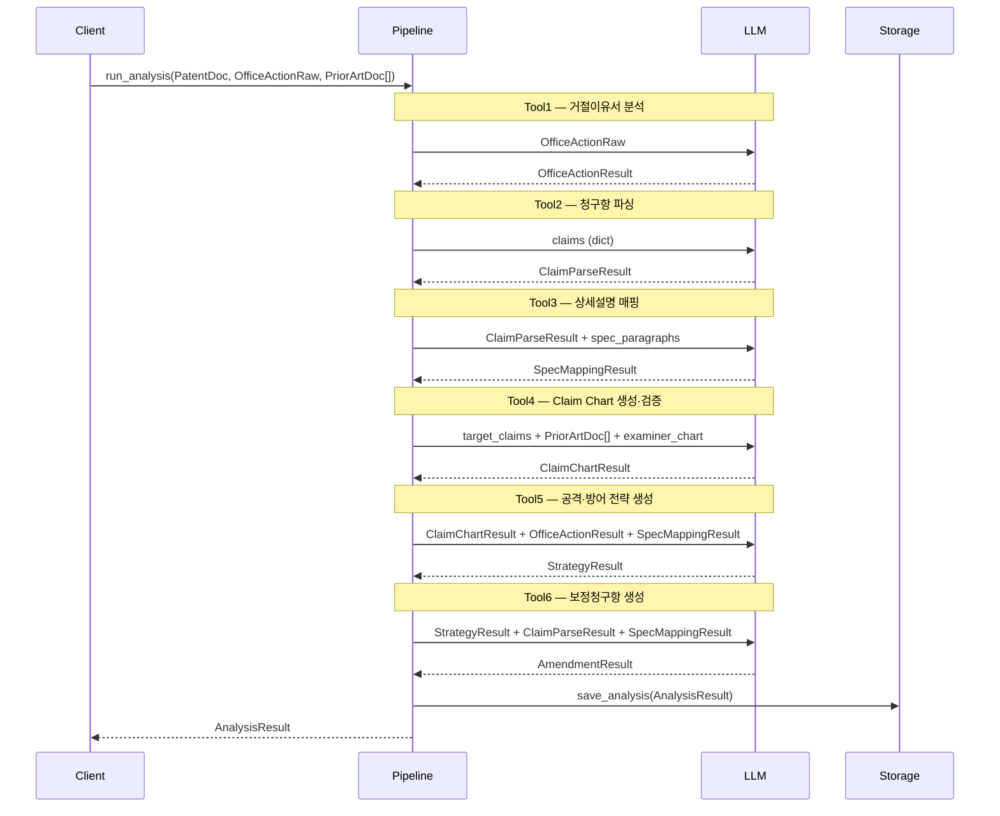

```mermaid
sequenceDiagram
    participant Client
    participant Pipeline
    participant LLM
    participant Storage

    Client->>Pipeline: run_analysis(PatentDoc, OfficeActionRaw, PriorArtDoc[])

    Note over Pipeline,LLM: Tool1 — 거절이유서 분석
    Pipeline->>LLM: OfficeActionRaw
    LLM-->>Pipeline: OfficeActionResult

    Note over Pipeline,LLM: Tool2 — 청구항 파싱
    Pipeline->>LLM: claims (dict)
    LLM-->>Pipeline: ClaimParseResult

    Note over Pipeline,LLM: Tool3 — 상세설명 매핑
    Pipeline->>LLM: ClaimParseResult + spec_paragraphs
    LLM-->>Pipeline: SpecMappingResult

    Note over Pipeline,LLM: Tool4 — Claim Chart 생성·검증
    Pipeline->>LLM: target_claims + PriorArtDoc[] + examiner_chart
    LLM-->>Pipeline: ClaimChartResult

    Note over Pipeline,LLM: Tool5 — 공격·방어 전략 생성
    Pipeline->>LLM: ClaimChartResult + OfficeActionResult + SpecMappingResult
    LLM-->>Pipeline: StrategyResult

    Note over Pipeline,LLM: Tool6 — 보정청구항 생성
    Pipeline->>LLM: StrategyResult + ClaimParseResult + SpecMappingResult
    LLM-->>Pipeline: AmendmentResult

    Pipeline->>Storage: save_analysis(AnalysisResult)
    Pipeline-->>Client: AnalysisResult
```
